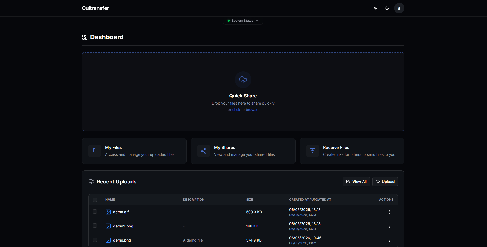
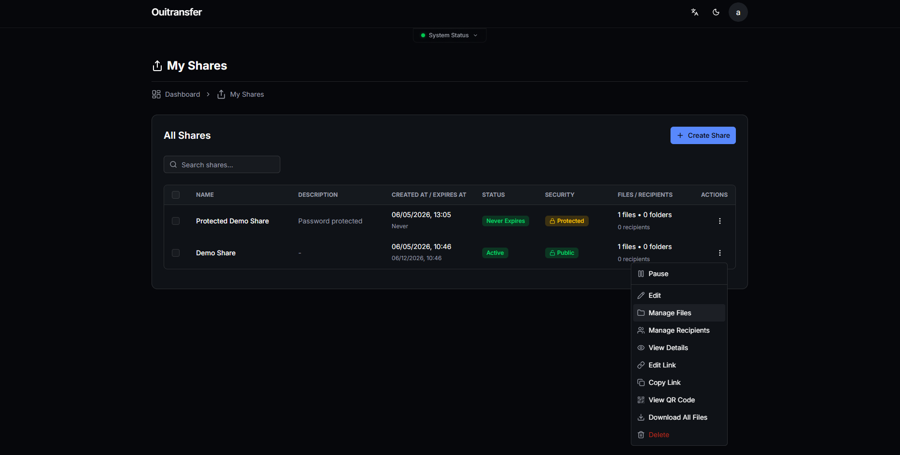
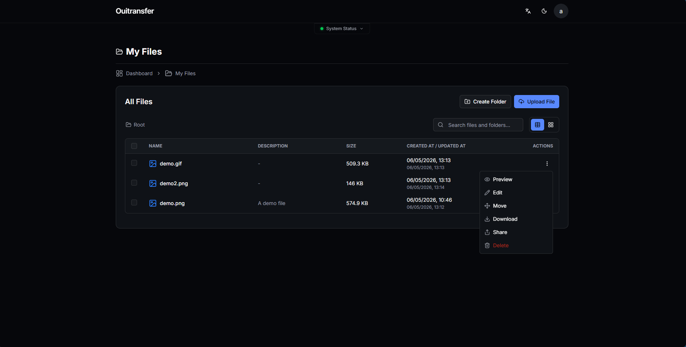
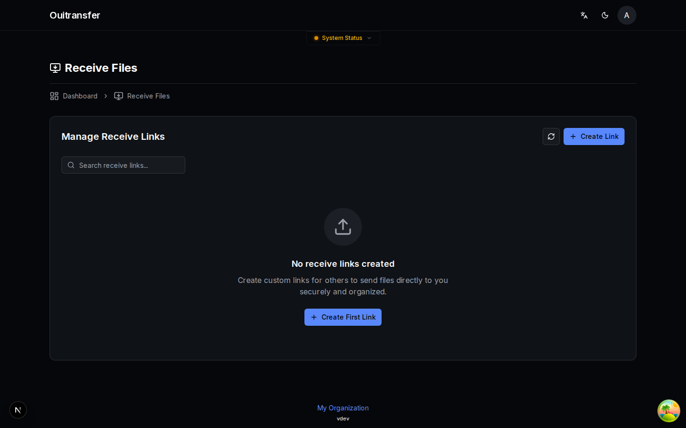

<div align="center">


<br/>
<br/>

[](LICENSE)
[](https://github.com/slvnlrt/ouitransfer/actions)
[](https://github.com/slvnlrt/ouitransfer/stargazers)
[](https://ko-fi.com/slvnlrt)

[**Documentation**](apps/docs/) · [**Quick Start**](#quick-start) · [**Contributing**](CONTRIBUTING.md)

</div>

---

Ouitransfer is a **self-hosted, open-source** file transfer platform. Upload files, share them via a link with optional passwords and expiration dates, and let others send files back to you, all on your own infrastructure, with no third-party dependencies and zero tracking.

## Screenshots

<div align="center">
  
  
  <br/>
  
  
</div>

## Features

- **Self-hosted**: deploy on any VPS, dedicated server, or cloud platform; no external services required
- **S3-compatible storage**: includes built-in RustFS (zero config, no dependencies) or connect any S3 provider (AWS, Backblaze, Cloudflare R2...)
- **Secure sharing**: password protection, expiration dates, view limits, per-share download notifications
- **Reverse shares**: create upload links so others can send files directly to you
- **User management**: multi-user, admin roles, storage quotas, and user groups with per-group quota policies
- **LDAP / Active Directory**: sync users and groups from your directory server
- **OIDC / SSO**: sign in with your identity provider (Zitadel, Google, Keycloak...)
- **2FA**: TOTP two-factor authentication (RFC 6238)
- **Email notifications**: configurable per event type, with cooldown periods and one-click unsubscribe
- **23 languages**: full internationalization including RTL support

## Quick Start

```bash
# 1. Create your env file, then fill in the required secrets
#    (generate each one with: openssl rand -hex 32)
cp .env.docker.example .env

# 2. Start all 3 services
docker compose up -d
```

| Service       | Default URL                 |
|---------------|-----------------------------|
| Web interface | http://localhost:5487        |
| API           | http://localhost:3333        |
| S3 storage    | http://localhost:9000        |

The first account registered becomes the administrator. See the [documentation](apps/docs/) for reverse proxy setup, LDAP, OIDC, SMTP, and production hardening.

## Tech Stack

| Layer          | Technology                                           |
|----------------|------------------------------------------------------|
| Backend        | Fastify 5 · Prisma · SQLite                         |
| Frontend       | Next.js 15 · React 19 · Tailwind CSS 4 · shadcn/ui  |
| Storage        | RustFS (built-in) or any S3-compatible provider      |
| Infrastructure | Docker Compose, 3 containers (storage, API, web)     |
| Monorepo       | pnpm workspaces · Turborepo                          |

## Contributing

See [CONTRIBUTING.md](CONTRIBUTING.md) for the full developer setup, commit conventions, and PR guidelines. The short version:

```bash
git clone https://github.com/slvnlrt/ouitransfer
cd ouitransfer
just setup-dev   # install deps, generate Prisma client, create local SQLite DB
just dev         # start all apps in watch mode (API · Web · Docs)
```

## Acknowledgements

Ouitransfer started from code in the [Palmr](https://github.com/kyantech/Palmr) project by Daniel Luiz Alves / Kyantech Solutions, Inc., also licensed under Apache 2.0. See [NOTICE](NOTICE).

## License

Apache 2.0. See [LICENSE](LICENSE).
