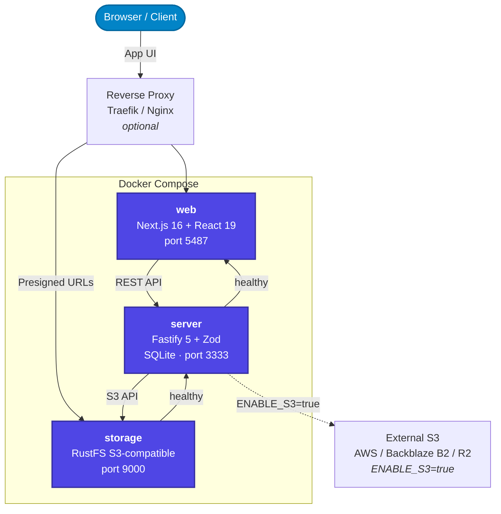

## Vue d'ensemble

OUITRANSFER s'exécute sous la forme de trois conteneurs Docker avec une séparation claire des responsabilités. Le navigateur communique avec le frontend **web** et directement avec le **stockage** pour les transferts de fichiers via URL présignées. Le **serveur** gère toute la logique métier et coordonne les interactions entre les deux.



L'ordre de démarrage est géré automatiquement via des `depends_on` basés sur les vérifications de santé : `storage` démarre en premier, puis `server` (une fois le stockage opérationnel), puis `web` (une fois le serveur opérationnel).

## Technologies utilisées

Chaque composant de l'architecture OUITRANSFER joue un rôle essentiel pour garantir fiabilité, performance et évolutivité. La pile technologique a été conçue avec la simplicité, la performance et la flexibilité en tête. Tout est auto-hébergé, accessible aux développeurs et conçu pour évoluer sans complexité superflue.

### SQLite + Prisma ORM

OUITRANSFER utilise **SQLite** comme solution de base de données principale, combinée à **Prisma ORM** pour des opérations de base de données typées. SQLite est une base de données légère et sans serveur, idéale pour démarrer rapidement tout en étant suffisamment robuste pour une utilisation en production. SQLite est entièrement conforme ACID, ce qui signifie qu'elle gère les transactions de manière sûre et fiable. Prisma fournit une boîte à outils moderne pour les bases de données, qui génère un client typé, gère les migrations et propose une API de requêtes intuitive. Ensemble, ils forment une combinaison puissante qui élimine la complexité d'administration des bases de données tout en offrant une excellente expérience aux développeurs.

- Fournit un stockage de données fiable et sécurisé, sans aucune configuration requise
- **Prisma ORM** propose des requêtes typées et une intégration automatique avec TypeScript
- Léger et rapide, parfait aussi bien pour le développement que pour la production
- Entièrement conforme ACID avec d'excellentes performances pour les métadonnées et les données transactionnelles
- Autonome, sans dépendances externes ni processus serveur requis
- Migrations et gestion du schéma facilitées via Prisma

### Next.js 16 + React 19 + TypeScript

Le frontend d'OUITRANSFER est construit avec **Next.js 16**, **React 19** et **TypeScript**, formant une pile moderne facile à maintenir et très rapide pour les utilisateurs finaux. Next.js 16 apporte les composants serveur, les actions serveur et un nouveau système de routeur applicatif qui rend le rendu de contenu dynamique extrêmement efficace. Cela permet de ne charger que ce qui est nécessaire, au moment où c'est nécessaire, ce qui donne une impression de réactivité même sous charge. React 19 offre une architecture basée sur les composants qui facilite la décomposition de l'interface en éléments réutilisables, et TypeScript contribue à prévenir les bugs avant même qu'ils ne surviennent, grâce au typage statique et à une meilleure navigation dans le code.

- **React 19** permet de créer une interface utilisateur dynamique et réactive grâce à une architecture par composants
- **TypeScript** ajoute le typage statique, améliorant la qualité du code et réduisant les erreurs à l'exécution
- **Next.js 16** gère le routage, le rendu côté serveur et les composants serveur pour des performances à l'échelle

### Stockage objet compatible S3

OUITRANSFER utilise un **stockage objet compatible S3** pour toutes les opérations sur les fichiers. Par défaut, une instance **RustFS** est fournie en tant que conteneur `storage`; aucun service externe n'est requis. Pour les utilisateurs qui préfèrent le stockage cloud ou ont besoin d'une évolutivité accrue, n'importe quel fournisseur compatible S3 (AWS S3, Backblaze B2, Cloudflare R2, etc.) peut être utilisé à la place en définissant `ENABLE_S3=true`.

- API compatible S3 pour toutes les opérations sur les fichiers
- **RustFS** intégré : aucune infrastructure supplémentaire requise pour les déploiements auto-hébergés
- **S3 externe** : activez via `ENABLE_S3=true` pour le stockage cloud ou une évolutivité accrue
- URLs présignées pour les téléversements et téléchargements directs sécurisés et limités dans le temps
- Chiffrement au repos géré par le fournisseur de stockage

Consultez [Fournisseurs S3](/docs/v1-beta/s3-providers) pour les instructions de configuration lors de l'utilisation d'un stockage externe.

### Fastify + Zod + TypeScript

Le backend d'OUITRANSFER est propulsé par **Fastify**, **Zod** et **TypeScript**, créant une couche API robuste et typée. Fastify est un framework web Node.js ultra-rapide, optimisé pour la performance et la faible empreinte mémoire, conçu pour gérer de nombreuses requêtes simultanées avec une utilisation minimale des ressources. Zod assure la validation de type à l'exécution et la définition des schémas, garantissant que toutes les données entrantes sont correctement validées avant d'atteindre la logique métier. TypeScript ajoute la sécurité de type à la compilation dans l'ensemble du code backend. Cette combinaison crée un backend hautement fiable et maintenable, qui prévient les bugs et les problèmes de sécurité tout en maintenant d'excellentes performances.

- **Fastify** assure un traitement rapide des requêtes avec un noyau léger
- **Zod** permet la validation de schéma à l'exécution et l'inférence de types via `fastify-type-provider-zod`
- **TypeScript** garantit la sécurité de type dans l'ensemble du code backend
- Validation basée sur les schémas intégrée pour une gestion sécurisée et fiable de l'API
- Architecture orientée plugins pour une extensibilité aisée
- Optimisé pour des performances élevées avec une utilisation minimale des ressources

## Architecture Docker

OUITRANSFER s'exécute sous la forme de **3 conteneurs Docker** avec un ordre de démarrage basé sur les vérifications de santé :

| Service | Image | Port | Description |
|---------|-------|------|-------------|
| **storage** | `rustfs/rustfs:latest` | 9000 | Stockage objet compatible S3 (RustFS) |
| **server** | `ouitransfer/server:latest` | 3333 | Serveur API Fastify + SQLite embarqué |
| **web** | `ouitransfer/web:latest` | 5487 | Frontend web Next.js |

L'ordre de démarrage est géré automatiquement : `storage` démarre en premier, puis `server` (une fois le stockage opérationnel), puis `web` (une fois le serveur opérationnel). Le point de terminaison de santé à `http://localhost:3333/health` renvoie l'état de la base de données et du stockage pour la supervision.

## Fonctionnement

L'architecture OUITRANSFER suit une séparation claire des responsabilités, facilitant la compréhension et la maintenance :

1. **Frontend**: React 19 + TypeScript + Next.js 16 gèrent l'interface utilisateur et les interactions
2. **Backend**: Fastify + Zod + TypeScript traitent les requêtes avec une sécurité de type complète et une validation
3. **Base de données**: SQLite + Prisma ORM stockent et gèrent les données avec des opérations typées
4. **Stockage de fichiers**: Le stockage objet compatible S3 (RustFS intégré ou S3 externe) gère toutes les opérations sur les fichiers
5. **Gestion des utilisateurs**: Groupes, quotas par utilisateur, synchronisation LDAP/AD et contrôle d'accès basé sur les rôles

## API

Le serveur Fastify expose une API REST complète qui alimente le frontend web et est disponible pour un usage direct. Consultez la [Référence API](/docs/v1-beta/api) pour la liste complète des points de terminaison, le flux d'authentification et les exemples curl.

La documentation interactive (Scalar + Swagger UI) est disponible à `http://localhost:3333/docs` et `http://localhost:3333/swagger` lorsque `ENABLE_API_DOCS=true` (toujours activé en développement).

## Flexibilité du stockage

OUITRANSFER est conçu pour être flexible dans la gestion du stockage de fichiers :

**Configuration par défaut (RustFS) :**

- Fichiers stockés dans le conteneur de stockage RustFS compatible S3 fourni
- Le port 9000 doit être accessible par les navigateurs pour les URLs présignées de téléversement/téléchargement
- Aucune configuration supplémentaire requise au-delà des identifiants de stockage
- Parfait pour les déploiements sur serveur unique et auto-hébergés

**S3 externe :**

- Activez le stockage S3 externe en définissant `ENABLE_S3=true`, consultez [Fournisseurs S3](/docs/v1-beta/s3-providers) pour plus d'informations.
- Compatible avec AWS S3, Backblaze B2, Cloudflare R2 et autres services compatibles S3
- Idéal pour les déploiements cloud et les configurations distribuées
- Offre des options supplémentaires d'évolutivité et de redondance

## Configuration de la sécurité

Trois secrets obligatoires doivent être configurés sur le conteneur `server` avant le déploiement :

| Variable | Exigence |
|----------|----------|
| `JWT_SECRET` | Min 32 caractères; signe les jetons d'accès JWT |
| `CSRF_SECRET` | Min 32 caractères, distinct de `JWT_SECRET`; clé HMAC pour les cookies CSRF double-submit |
| `COOKIE_SECRET` | Min 32 caractères, distinct des deux précédents; signe les cookies de session |
| `ENCRYPTION_SECRET` | Requis (min 32 caractères), distinct des trois précédents ; clé AES-256-GCM pour le chiffrement des données sensibles au repos (secret TOTP 2FA, mot de passe de liaison LDAP) |

Générez chaque secret avec :

```bash
openssl rand -hex 32
```

Les trois valeurs doivent être différentes. Définir l'une d'elles à une chaîne vide empêchera le serveur de démarrer.

## Liens utiles

- [Documentation SQLite](https://www.sqlite.org/docs.html)
- [Documentation Prisma](https://www.prisma.io/docs)
- [Documentation Next.js](https://nextjs.org/docs)
- [Documentation React](https://react.dev/)
- [Manuel TypeScript](https://www.typescriptlang.org/docs/)
- [Documentation Fastify](https://fastify.dev/docs/latest/)
- [Documentation Zod](https://zod.dev/)
- [Documentation RustFS](https://rustfs.com/docs/)
