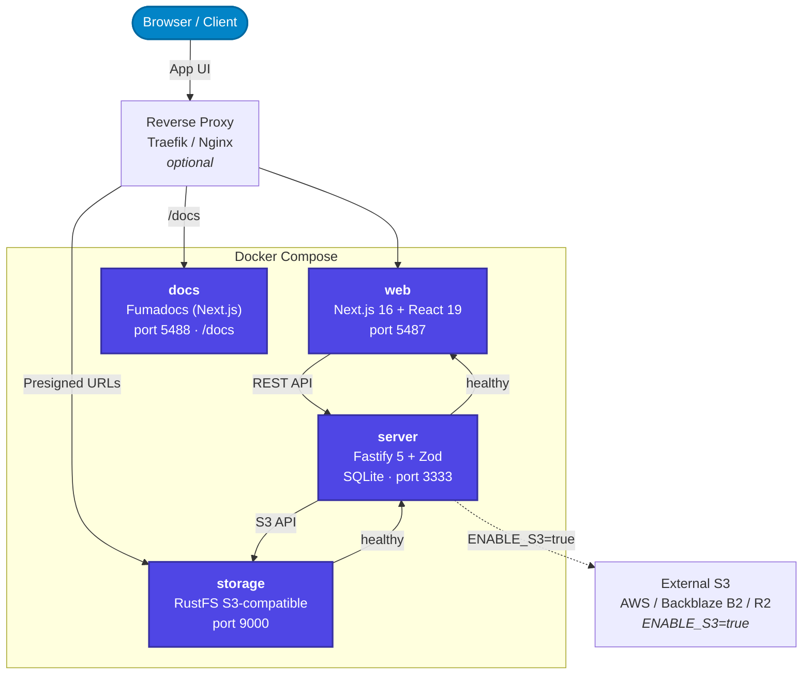

## Overview

OUITRANSFER runs as four Docker containers with a clear separation of concerns. The three core containers handle the application: the browser talks to the **web** frontend and directly to **storage** for presigned file transfers, and the **server** handles all business logic and coordinates between the two. A fourth, self-contained **docs** container serves this documentation site under `/docs`; it is independent of the rest and can be removed without affecting the application.



Startup order for the three core containers is managed automatically via healthcheck-based `depends_on`: `storage` starts first, then `server` (once storage is healthy), then `web` (once server is healthy). The `docs` container has no such dependency and starts independently.

## Technologies used

Each component in the OUITRANSFER architecture plays a vital role in ensuring reliability, performance, and scalability. The stack is built with simplicity, performance, and flexibility in mind. Everything is self-hosted, developer-friendly, and designed to scale without adding unnecessary complexity.

### SQLite + Prisma ORM

OUITRANSFER uses **SQLite** as the primary database solution combined with **Prisma ORM** for type-safe database operations. SQLite is a lightweight, serverless database that's perfect for getting started quickly while still being powerful enough for production use. SQLite is fully ACID-compliant, which means it handles transactions safely and reliably. Prisma provides a modern database toolkit that generates a type-safe client, handles migrations, and offers an intuitive query API. Together, they create a powerful combination that eliminates database administration complexity while providing excellent developer experience.

- Provides reliable and secure data storage with zero configuration required
- **Prisma ORM** offers type-safe queries and automatic TypeScript integration
- Lightweight and fast, perfect for both development and production environments
- Fully ACID-compliant with excellent performance for metadata and transactional data
- Self-contained with no external dependencies or server processes needed
- Easy database migrations and schema management through Prisma

### Next.js 16 + React 19 + TypeScript

The frontend of OUITRANSFER is built using **Next.js 16**, along with **React 19** and **TypeScript**, forming a modern stack that's easy to maintain and super fast for end users. Next.js 16 brings server components, server actions, and a new app router system that makes rendering dynamic content incredibly efficient. This allows us to load only what's needed, when it's needed - which makes the app feel snappy even under load. React 19 provides a clean, component-based structure that makes it easy to break the UI into reusable pieces, and TypeScript helps prevent bugs before they even happen by enforcing static typing and better code navigation.

- **React 19** enables the creation of a dynamic and responsive user interface with a component-based architecture
- **TypeScript** adds static typing, enhancing code quality and reducing runtime errors
- **Next.js 16** handles routing, server-side rendering, and server components for performance at scale

### S3-Compatible Object Storage

OUITRANSFER uses **S3-compatible object storage** for all file operations. By default, a **RustFS** instance is bundled as the `storage` container; no external service required. For users who prefer cloud storage or need additional scalability, any S3-compatible provider (AWS S3, Backblaze B2, Cloudflare R2, etc.) can be used instead by setting `ENABLE_S3=true`.

- S3-compatible API for all file operations
- **RustFS** built-in: zero additional infrastructure required for self-hosted deployments
- **External S3**: enable via `ENABLE_S3=true` for cloud storage or additional scalability
- Presigned URLs for secure, time-limited direct uploads and downloads
- Encryption at rest managed by the storage provider

See [S3 Providers](/docs/v1-beta/s3-providers) for setup instructions when using external storage.

### Fastify + Zod + TypeScript

The backend of OUITRANSFER is powered by **Fastify**, **Zod**, and **TypeScript**, creating a robust and type-safe API layer. Fastify is a super-fast Node.js web framework optimized for performance and low overhead, designed to handle lots of concurrent requests with minimal resource usage. Zod provides runtime type validation and schema definition, ensuring all incoming data is properly validated before reaching business logic. TypeScript adds compile-time type safety throughout the entire backend codebase. This combination creates a highly reliable and maintainable backend that prevents bugs and security issues while maintaining excellent performance.

- **Fastify** provides fast request handling with a lightweight core
- **Zod** enables runtime schema validation and type inference via `@fastify/type-provider-zod`
- **TypeScript** ensures type safety across the entire backend codebase
- Built-in schema-based validation for secure and reliable API handling
- Supports plugin-based architecture for easy extensibility
- Optimized for high performance with minimal resource usage

## Docker architecture

OUITRANSFER runs as **4 Docker containers**. The three core services use healthcheck-based startup ordering; the documentation site is independent:

| Service | Image | Port | Description |
|---------|-------|------|-------------|
| **storage** | `rustfs/rustfs:latest` | 9000 | S3-compatible object storage (RustFS) |
| **server** | `ghcr.io/slvnlrt/ouitransfer-server:latest` | 3333 | Fastify API server + embedded SQLite |
| **web** | `ghcr.io/slvnlrt/ouitransfer-web:latest` | 5487 | Next.js web frontend |
| **docs** | `ghcr.io/slvnlrt/ouitransfer-docs:latest` | 5488 | Fumadocs documentation site (served under `/docs`) |

Startup order for the core services is managed automatically: `storage` starts first, then `server` (once storage is healthy), then `web` (once server is healthy). The `docs` container starts independently. The liveness endpoint at `http://localhost:3333/health` returns a coarse `{ status, timestamp, uptime }` for monitoring; the detailed per-subsystem breakdown (database, storage, email) lives on the authenticated `/health/status` endpoint. See the [API Reference](/docs/v1-beta/api#health) for details.

## How it works

The OUITRANSFER architecture follows a clean separation of concerns, making it easy to understand and maintain:

1. **Frontend**: React 19 + TypeScript + Next.js 16 handle the user interface and user interactions
2. **Backend**: Fastify + Zod + TypeScript process requests with full type safety and validation
3. **Database**: SQLite + Prisma ORM store and manage data with type-safe operations
4. **File Storage**: S3-compatible object storage (RustFS built-in or external S3) handles all file operations
5. **User Management**: Groups, per-user quotas, LDAP/AD synchronization, and role-based access control

## API

The Fastify server exposes a full REST API that powers the web frontend and is available for direct use. See the [API Reference](/docs/v1-beta/api) for the complete endpoint list, authentication flow, and curl examples.

Interactive documentation (Scalar + Swagger UI) is available at `http://localhost:3333/docs` and `http://localhost:3333/swagger` when `ENABLE_API_DOCS=true` (always enabled in development).

## Storage flexibility

OUITRANSFER is designed to be flexible in how you handle file storage:

**Default setup (RustFS):**

- Files stored in the bundled RustFS S3-compatible storage container
- Port 9000 must be reachable by browsers for presigned upload/download URLs
- No additional configuration required beyond storage credentials
- Perfect for single-server and self-hosted deployments

**External S3:**

- Enable external S3 storage by setting `ENABLE_S3=true`, see [S3 Providers](/docs/v1-beta/s3-providers) for more information.
- Compatible with AWS S3, Backblaze B2, Cloudflare R2, and other S3-compatible services
- Ideal for cloud deployments and distributed setups
- Provides additional scalability and redundancy options

## Security configuration

Three mandatory secrets must be configured on the `server` container before deployment:

| Variable | Requirement |
|----------|-------------|
| `JWT_SECRET` | Min 32 chars; signs JWT access tokens |
| `CSRF_SECRET` | Min 32 chars, distinct from `JWT_SECRET`; HMAC key for CSRF double-submit cookies |
| `COOKIE_SECRET` | Min 32 chars, distinct from both above; signs session cookies |
| `ENCRYPTION_SECRET` | Required (min 32 chars), distinct from the three above; AES-256-GCM key for encrypting sensitive data at rest (2FA TOTP secret, LDAP bind password) |

Generate each secret with:

```bash
openssl rand -hex 32
```

All three values must be different. Setting any of them to an empty string will cause the server to refuse to start.

## Useful links

- [SQLite Documentation](https://www.sqlite.org/docs.html)
- [Prisma Documentation](https://www.prisma.io/docs)
- [Next.js Documentation](https://nextjs.org/docs)
- [React Documentation](https://react.dev/)
- [TypeScript Handbook](https://www.typescriptlang.org/docs/)
- [Fastify Documentation](https://fastify.dev/docs/latest/)
- [Zod Documentation](https://zod.dev/)
- [RustFS Documentation](https://rustfs.com/docs/)
